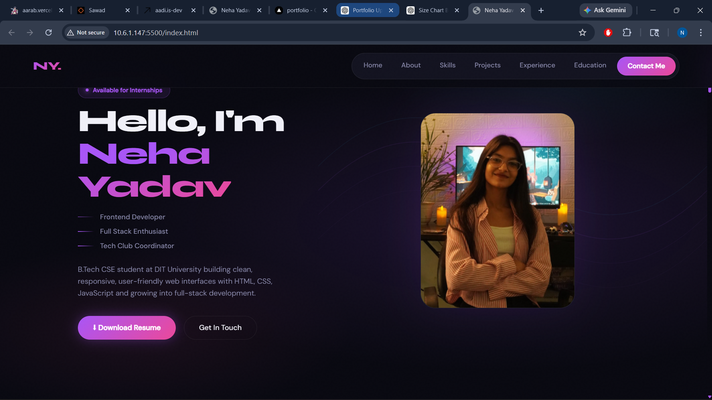
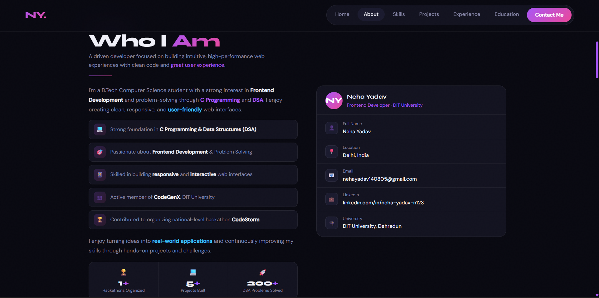
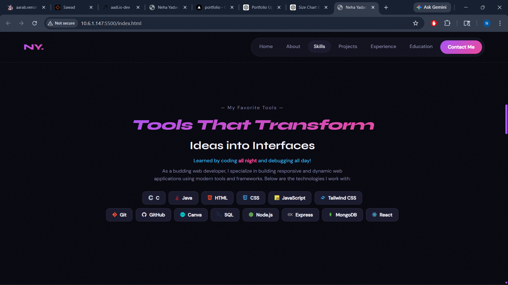
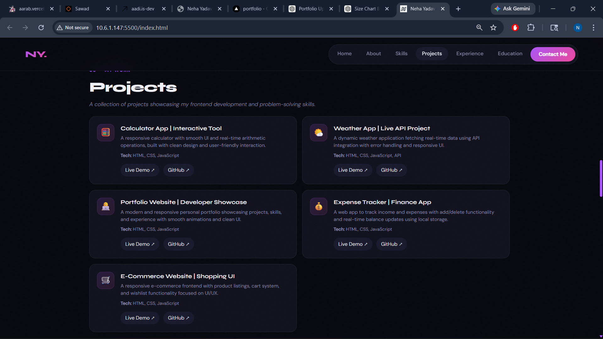
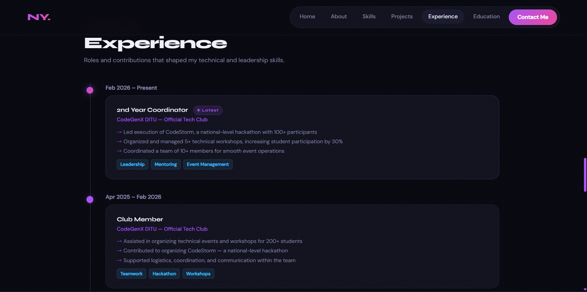
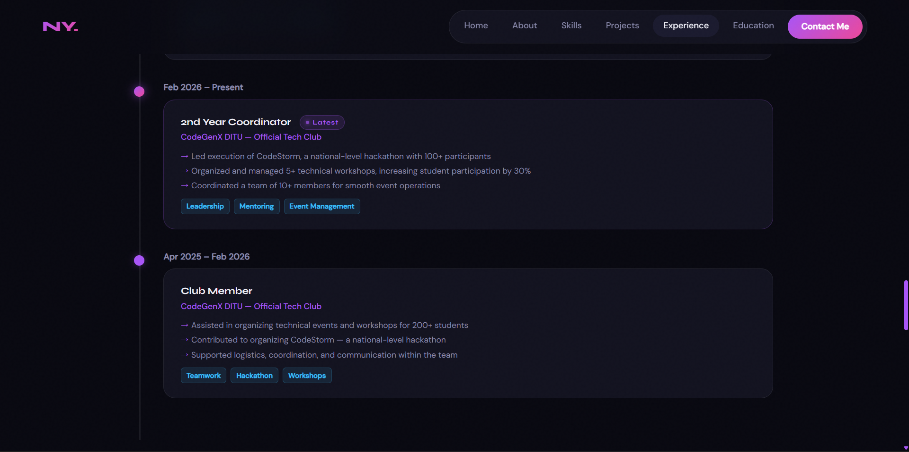
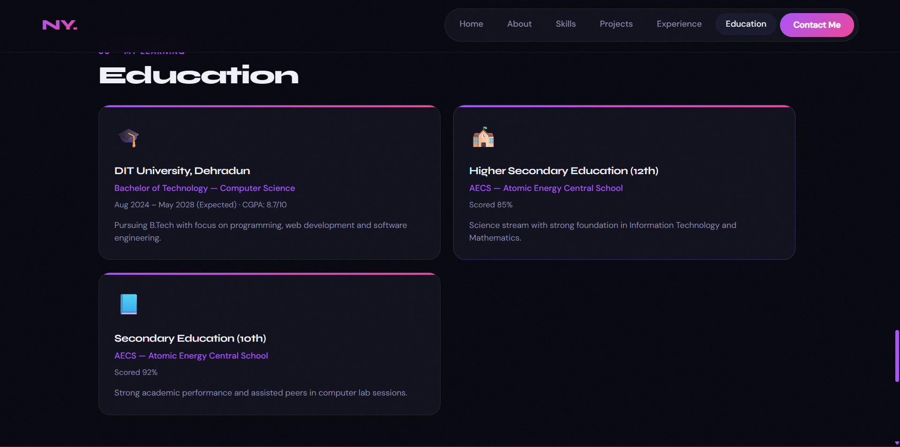
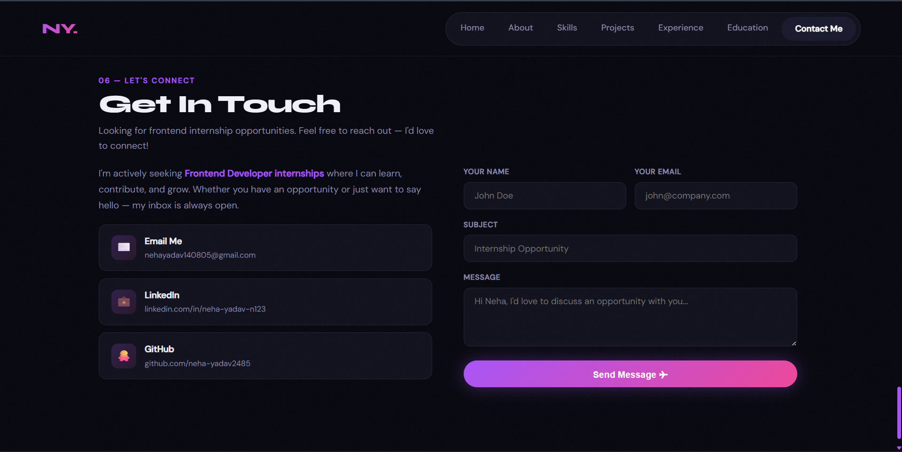

# 🌐 Personal Portfolio Website

✨ A modern, responsive portfolio showcasing my journey as a Frontend Developer — including projects, skills, and experience.

🔗 **Live Website:**
👉 https://portfolio-orcin-kappa-ixn98kty1d.vercel.app

---

## 🚀 Features

* Smooth scroll & snap navigation
* Clean and modern UI design
* Fully responsive (mobile + desktop)
* Interactive project showcase (Live + GitHub links)
* Skills, experience, and education sections
* Contact section with user-friendly interaction

---

## 🖼️ Website Preview

### 🏠 Home Page



---

### 🙋‍♀️ About Me



---

### 🛠️ Skills



---

### 💼 Projects



---

### 📊 Experience




---

### 🎓 Education



---

### 📬 Contact Me



---

## 🧠 Projects Included

| Project               | Live Demo                                            | Code                                                |
| --------------------- | ---------------------------------------------------- | --------------------------------------------------- |
| 🧮 Calculator         | https://calculator-rust-mu-72.vercel.app             | https://github.com/neha-yadav2485/CALCULATOR        |
| 🌤️ Weather App       | https://weather-app-five-khaki-unyhqeuxy0.vercel.app | https://github.com/neha-yadav2485/WEATHER-APP       |
| 💰 Expense Tracker    | https://expense-tracker-pearl-seven-48.vercel.app    | https://github.com/neha-yadav2485/EXPENSE_TRACKER   |
| 🛒 E-Commerce Website | https://e-commerce-website-mu-lilac.vercel.app       | https://github.com/neha-yadav2485/ECOMMERCE-WEBSITE |

---

## 🛠️ Tech Stack

* HTML5
* CSS3
* JavaScript
* Vercel (Deployment)

---

## 📁 Folder Structure

```
portfolio/
│── index.html
│── style.css
│── script.js
│── Preview/
│   ├── 1.HomePage.png
│   ├── 2.AboutMe.png
│   ├── 3.Skills.png
│   ├── 4.Projects.png
│   ├── 5.Experience.png
│   ├── 6.Education.png
│   ├── 7.ContactMe.png
```

---

## 📌 How to Run Locally

1. Clone the repository

```bash
git clone https://github.com/neha-yadav2485/PORTFOLIO.git
```

2. Open the folder

3. Run `index.html` in your browser

---

## 👩‍💻 Author

**Neha Yadav**
Frontend Developer

🔗 LinkedIn: https://www.linkedin.com/in/neha-yadav-n123

---

## ⭐ Support

If you like this project, don’t forget to ⭐ the repo!
